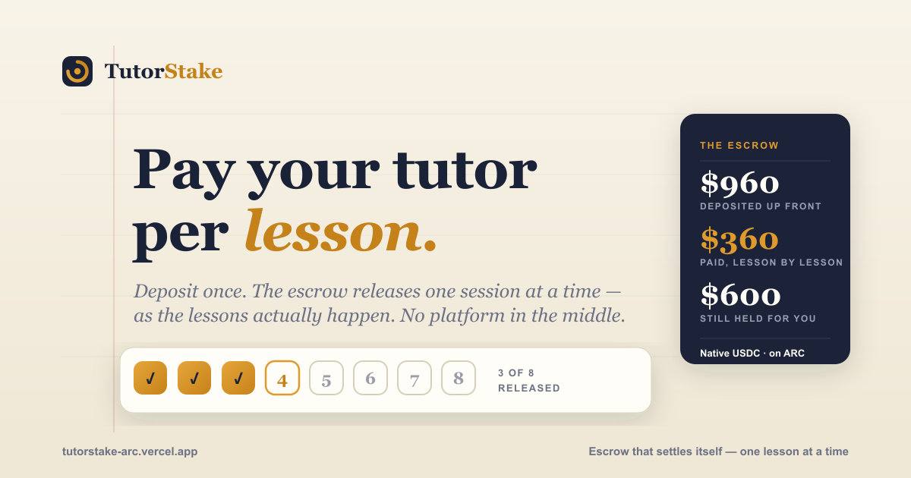

<p align="center">
  
</p>

<h1 align="center">TutorStake</h1>

<p align="center"><em>Pay your tutor per lesson. The escrow releases one session at a time — as the lessons actually happen.</em></p>

<p align="center">
  <a href="https://tutorstake-arc.vercel.app">Live app</a> ·
  <a href="https://testnet.arcscan.app/address/0xB5b45aE5D33b75F231C3945fe3538AF5a53000Ec">Contract on ArcScan</a> ·
  Native USDC on ARC testnet
</p>

---

## Why this exists

Paying a tutor is an awkward little standoff. Pay the whole course up front and you're trusting someone you've met twice. Pay after every lesson and you're chasing invoices, juggling apps, eating fees. Either way somebody is carrying the risk, and usually it's whoever has less leverage.

TutorStake removes the standoff by putting the money where neither side can quietly walk off with it: **in the contract**.

You deposit the full course at the start — say eight lessons at $120. That money is locked, visible, and yours until a lesson is taught. After each session the tutor marks it done; you confirm with one tap and exactly one lesson's pay leaves the escrow. Not the whole course. One lesson. The other seven keep sitting there with your name on them.

## How it works

A plan is a subject, a price per lesson, a number of lessons, and the two wallets involved.

1. **Open a plan.** The student picks a tutor, sets the price and the lesson count, and deposits `price × lessons` in USDC. It goes straight into the contract.
2. **Teach a lesson.** Afterwards the tutor calls `markDone` on that plan — one lesson can be pending at a time.
3. **Confirm.** The student taps confirm and the contract releases one lesson's pay to the tutor on the spot. The session counter ticks up by one.
4. **Repeat** until the course is finished, or stop whenever you like.

Three things keep it fair when people don't behave perfectly:

- **The lesson didn't happen?** The student can reject a marked lesson. That session is refunded and dropped from the plan — so the same lesson can't be marked and re-marked forever to grind the student down.
- **The student went quiet?** A marked lesson the student never confirms can be settled by *anyone* after a 24-hour window, so a tutor who did the work still gets paid even if the student ghosts. (On ARC this is a natural job for an agent or a keeper — it costs a sliver of USDC and needs no permission.)
- **Changed your mind?** As long as no lesson is mid-confirmation, the student can close the plan and reclaim every unused lesson. You're never locked into lessons you haven't taken.

No platform account holds the funds. No 15% cut. The escrow *is* the bookkeeper, and every figure on the page — deposited, paid, still held — is read straight off the chain.

## Why ARC

ARC is a chain where **USDC is the native unit** — it's the gas and the money at the same time. That matters here for boring, practical reasons:

- A lesson is worth tens of dollars, and the cost to release it is a rounding error. Per-lesson settlement is only sensible when the fee to do it is negligible.
- Payouts land in **USDC**, not a token you then have to swap and hope holds its value. A tutor's $120 is $120.
- Settlement is effectively instant, so "confirm" and "paid" are the same moment.
- And because anyone can settle an unconfirmed lesson, the boring upkeep can be handed to **software** — the kind of small, autonomous, pay-as-you-go money movement ARC is built for.

## The contract

[`TutorStake.sol`](contracts/TutorStake.sol) is one file, no dependencies, no admin, no owner, no upgrade switch, no fee. Nobody — not even its author — can pull funds out of it. Money only ever moves to the tutor (on confirm/settle) or back to the student (on reject/close).

| | |
|---|---|
| **Network** | ARC testnet (chain `5042002`) |
| **Address** | [`0xB5b45aE5D33b75F231C3945fe3538AF5a53000Ec`](https://testnet.arcscan.app/address/0xB5b45aE5D33b75F231C3945fe3538AF5a53000Ec) |
| **Settlement** | native USDC, 18 decimals |
| **Confirmation window** | 24 hours |
| **Verified** | yes — source on ArcScan |

It follows checks-effects-interactions on every path that moves money, marks state before it pays out, and keeps exactly one lesson pending per plan so there's never an ambiguous balance.

## Running it locally

```bash
npm install
npm run dev          # http://localhost:3000
```

The address is baked into [`lib/tutorstake.ts`](lib/tutorstake.ts), so the app reads live state the moment it loads — no env file needed to browse. To use it you'll need a wallet on ARC testnet with some test USDC; the app offers to add the network for you.

To recompile the contract:

```bash
node scripts/compile.js
```

## Built with

Next.js 16 · React 19 · ethers v6 · Solidity 0.8.35 · Tailwind v4 — deployed on Vercel, settling on ARC.

---

<p align="center"><sub>Lessons are taught one at a time. Money should move the same way.</sub></p>
